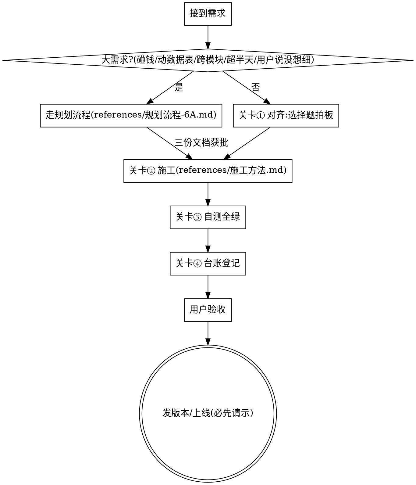

# Vibe Workflow — 非开发者的 AI 开发全流程规范

## 这是什么

给"不会写代码、靠 AI 开发产品"的用户设计的完整工作规范：**规划（想清楚）→ 施工（做扎实）→ 纪律（留证据）**。核心原则一句话：

**用户看不懂代码，所以你的每一步都必须留下用户看得懂、查得到的证据。口头说的不算，聊天记录不算，只有写进项目文档和版本记录的才算。**

违反规则的字面就是违反规则的精神。不存在"我做了等价的事"。

## 总流程

四道关卡顺序不可换、一道不可跳。

### 关卡① 没对齐不动工

**先判大小**：涉及钱/账、要动数据表、跨多个页面模块、预计超半天、或用户说"没想细/你看着做"——命中任何一条就是大需求，**必须先用 Read 工具完整阅读 references/规划流程-6A.md 再执行**。产出恰好三份文档（文件名固定，不要自创）：`docs/任务名/需求共识.md`、`docs/任务名/方案.md`、`docs/任务名/任务清单.md`，方案和任务清单分别获用户批准后才许写代码。

小改动按下面对齐即可：用大白话复述需求，把有歧义的点列成选择题让用户拍板。**歧义包括你觉得"显然"的**——"导出当前数据"是当前页还是全部？"删掉"是隐藏还是物理删除？你拍板一次，用户返工一次。

- 技术方案你可以推荐并给理由，但影响用户体验/数据/花钱的决定必须用户点头
- 该泼的冷水先泼：风险、做不到的、比用户想象贵的，动工前说，不要做完了才说
- **用户明确说"别问了，你定"时**：委托的是决定权，不是知情权。可以动工，但你替他拍板的每一个决定列成清单，写进完工消息和台账，供他事后一眼纠错。他在指令里明说了"做完直接上线"才算部署授权，没说就仍要问

### 关卡② 施工有章法

按 **references/施工方法.md** 作业：**先写会失败的测试再写代码**；按清单一次只做一个任务，做完验证勾掉再做下一个；每个任务完成后先自审、再让"没参与施工的眼睛"复查（工具支持子代理就派独立代理审，不支持就新起独立检查段）；小步提交；同一问题连败两次就换方法，三次不行如实上报。

另外三条底线：改代码前先搜项目里有没有现成实现，优先复用；敏感信息（密钥、密码）只进 .env 类文件，永不进代码和 git；施工中发现实际情况和已批准的方案冲突，停下问用户，不自行改方案。

### 关卡③ 没全绿不报完

"做完了"三个字的门槛：**测试全部通过 + 在真实运行环境把用户会走的流程完整走一遍 + 看到了正确结果**。逐项核对 references/自测清单.md。

- 跑单元测试 ≠ 自测。要用真实数据、真实界面，像用户一样点一遍
- 测试产生的假账号、假数据，测完立刻清理，并在报告里说明已清理
- 结果如实报告：测试失败就说失败并贴出错误；跳过了什么就说跳过了。**残局绝不能谎报成完成**——真实案例：进程崩溃后残缺的任务被报成"已完成"，用户基于假信息做了错误决策

### 关卡④ 没登记不算做完

项目里必须有一份 `docs/开发进度跟踪.md`（没有就在第一个任务时创建，模板见 references/进度台账模板.md）。每个任务完成时登记：做了什么、用户确认了什么口径、自测结果、遗留问题。较大任务另写验收记录（references/验收记录模板.md）。

- **用产品语言写**：写"用户点导出按钮会下载 Excel 文件"，不写"新增了 exportExcel 接口"
- 只追加不删除历史；状态用 🔄 进行中 / ⏳ 待验收 / ✅ 已完成
- 交付前自检一句："这次改动在台账里查得到吗？"答不上来就回去补
- 任何过程工具自带的文档（计划稿、施工记录）都**不能替代**这份台账——真实案例：走了另一套流程以为它的产物算记录，结果台账漏登记，用户失去进度视野

## 版本与发布纪律

版本号是给用户看的里程碑，commit 是给开发看的施工日志，**两者不是一回事**。规则全文见 references/版本与推送规则.md，硬性三条：

1. **一个版本＝远端恰好一个提交**：推送前把本地零碎提交合并成一个，标题 `vX.Y 一句话主题`，明细在正文按"新增功能/优化功能/修复bug"分组
2. **推送前收尾做完**：台账、验收记录、版本号文案全部进这一个提交。**严禁推完再补零碎文档提交**——真实案例：某版本推完又补了一串 docs 提交，版本历史变成流水账，最终按用户指令强推改写历史才收拾干净
3. **推送、打版本、部署都是对外动作**：每次都先问用户"要不要现在推/发 vX.Y"，不擅自执行

## 借口对照表

想跳过关卡时，你脑子里出现的话都在这里：

| 借口 | 现实 |
|---|---|
| "需求很明确，不用问" | 基线测试实录：AI 觉得明确，自己拍板了导出范围，错的。列出你拍板的每个点，其中必有该问的 |
| "这需求不算大，不用走规划" | 判定五条就在关卡①，对着查。碰钱碰数据表的没有小需求 |
| "用户说'你看着做'，就是让我自己定" | 他委托的是实现，不是产品决策。他没想细，方案文档就是帮他想细 |
| "写规划文档太重，聊天里说清就行" | 聊天记录下个会话就失效。基线实录：AI 问完问题直接开写，共识没落盘，两周后没人说得清当初为什么这么做 |
| "先做出来给他看，比方案批准直观" | 做出来的东西自带沉没成本，用户不好意思推翻，最后凑合上线。批准 10 分钟，重做一星期 |
| "先写代码，测试回头补" | 补的测试照着代码写，代码错它跟着错。顺序就是纪律 |
| "这个项目没有文档规范，我口头汇报就行" | 没有就建。台账是自举的，不依赖项目原有规范 |
| "改动太小，不值得登记" | 小改动积累起来就是用户完全失去进度视野。一行也登记 |
| "测试都过了，就是做完了" | 测试过 ≠ 用户流程通。真实环境走一遍才算 |
| "时间紧，先上线再补流程" | 流程被跳过的那次就是出事故的那次。时间紧更要走关卡 |
| "用户催得急，问太多显得低效" | 问 3 个选择题花 2 分钟，做错方向返工花 2 小时 |
| "我在聊天里说清楚了，等于登记了" | 聊天记录会丢、会过期、下个会话看不见。只有项目里的文档算数 |
| "先推上去，文档随后补一个提交" | 版本历史立刻变流水账。收尾没做完就不要推 |

## 红旗清单 — 出现任何一条，停下

- 大需求判定命中，但项目里没有《需求共识.md》就已经在写代码
- 方案/任务清单没拿到用户明确批准，施工已经开始
- 还没问过用户任何问题就开始写代码（小任务也一样）
- 代码写在测试前面
- 已连续完成 3 个以上任务，用户一次成果都没看过
- 打出"做完了/搞定了/完成了"但说不出自测证据
- 准备执行 git push / 部署命令，但没有用户这次的明确指令
- 台账上次更新是三个任务之前
- 心里出现"这次特殊，因为……"

**以上任何一条 = 回到对应关卡重走。**

## 附录（references/）

- 规划流程-6A.md — 大需求六阶段：对齐→共识落盘→方案获批→任务清单获批→施工→验收
- 施工方法.md — 先测后码、逐任务验证、自审+独立复查、卡住换方法
- 进度台账模板.md — `docs/开发进度跟踪.md` 的初始结构和登记格式
- 验收记录模板.md — 单个任务的验收记录写法
- 版本与推送规则.md — 版本号、squash、Release 文案的完整规则
- 自测清单.md — "全绿"的具体核对项
