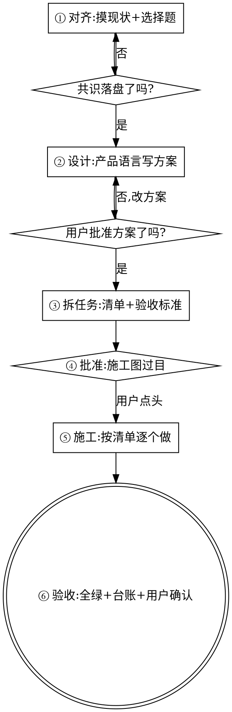

# 规划流程（6A 工作流）—— 从想法到施工图

## 这是什么

不会写代码的用户提一个大需求（"加个会员积分系统，你看着做"），最危险的不是做得慢，而是**AI 按自己的想象把它做完了**。本 skill 把模糊想法变成用户批准过的施工图，然后才允许动工。

本文是 vibe-workflow 关卡①的大需求分支细则：命中判定就必须完整走完六阶段，才能进入关卡②施工。

## 什么算"大需求"（触发判定）

满足任何一条就走本流程，一条不满足就跳过（直接按关卡①对齐后动工）：

- 涉及钱、账、积分、优惠券等"钱等价物"
- 要新建或修改数据表结构
- 跨多个页面/模块
- 预计超过半天的工作量
- 用户自己说"没想太细/你看着办"——**想得越粗，越需要规划**

## 六个阶段，三份落盘文档

### ① 对齐 —— 先摸现状，再问选择题，共识落盘

1. 读进度台账、搜项目现有代码：有没有相关功能、会碰到哪些已有逻辑。**能自己查到的不许问用户**
2. 把真正需要用户拍板的歧义列成选择题（带你的推荐和理由），一条消息发完
3. 用户答完，写 `docs/任务名/需求共识.md`：需求大白话描述、每条拍板口径、明确不做什么、怎么算验收通过

**聊天里说清楚了不算对齐**——共识必须落盘成文件，否则下个会话全部失忆，用户又要重讲一遍。

### ② 设计 —— 方案让用户看得懂，批准才继续

写 `docs/任务名/方案.md`，全文用产品语言：

- 用户会看到什么页面、什么流程（一步一步描述）
- 系统会记住哪些信息（不写表结构黑话，写"每一笔积分的来龙去脉都留痕，方便对账"）
- **泼冷水一节（必须有）**：风险、做不到的、工作量比想象大的地方、你建议砍掉的部分
- 技术选型放最后一小节，写"为什么这么选"，用户可跳过

**复杂项目附加：技术设计章节（伸缩条款）**。命中任一条——互相配合的模块/页面 ≥3 个、含后台任务/定时任务/多端同步等结构性机制、要对接外部服务——《方案.md》末尾必须附一章"技术设计"：整体架构图（Mermaid）、模块之间谁调用谁、关键数据怎么流转、项目统一采用的机制约定（如"耗时操作一律走后台任务+进度轮询"）。这一章是写给"下一个会话的 AI"看的，用户可跳过不读；它是日后修问题时判断"改法是否与既有架构同构"的唯一依据，项目越复杂越不能省。施工中架构真的变了，必须回来改这一章——文档和现实对不上比没有文档更害人。

发给用户，明确问"方案照这个来吗？"**批准前不进下一阶段。**

### ③ 拆任务 —— 施工图

写 `docs/任务名/任务清单.md`：每个任务一条，包含"做什么 + 怎么验收 + 依赖哪个任务"。拆分标准：**每个任务一次做得完、能单独验证给用户看**。排出先后顺序。

### ④ 批准 —— 动工前最后一道门

三份文档链接发给用户："共识、方案、任务清单都在这，确认后开工。"拿到明确同意才写第一行代码。

### ⑤ 施工 —— 分阶段，不憋大招

- 按清单顺序做，每完成一个任务：验证 → 在清单上勾掉 → 台账更新状态
- **阶段性给用户看**：完成一个能演示的小阶段就展示一次，等确认再继续。严禁闷头把整个系统做完才第一次露面
- 中途发现实际情况和方案冲突：**停下，说明冲突，问用户**，不许自行改方案继续

### ⑥ 验收 —— 交还给 vibe-workflow

回到主规范关卡③④走：自测全绿（真实环境走流程）→ 台账登记 → 用户验收。

## 借口对照表

| 借口 | 现实 |
|---|---|
| "这需求不算大，不用走流程" | 判定标准就在上面五条，对着查。碰钱碰数据表的没有小需求 |
| "用户说'你看着做'，就是让我自己定" | 他委托的是实现，不是产品决策。他没想细，方案文档就是帮他想细 |
| "写三份文档太重了，聊天里说清就行" | 聊天记录下个会话就失效。基线实测：AI 问完问题直接开写，共识没落盘，两周后没人说得清当初为什么这么做 |
| "方案批准太慢，先做出来给他看更直观" | 做出来的东西自带沉没成本，用户不好意思推翻，最后凑合上线。批准 10 分钟，重做一星期 |
| "一口气做完再展示，效率高" | 方向错一点，整个系统全错。分阶段展示是止损机制 |
| "架构我心里有数，不用画出来" | 下个会话就失忆。没落盘的架构等于不存在，后续修改无从判断"是否与既有架构同构" |

## 红旗清单 — 出现任何一条，停下

- 大需求判定命中，但项目里找不到《需求共识.md》就已经在写代码
- 方案还没得到用户明确的"可以/照这个做"，施工已经开始
- 已经连续完成 3 个以上任务，用户还一次成果都没看过
- 发现方案有问题，心里想"我调整一下他应该不会介意"

**以上任何一条 = 回到对应阶段补关卡。**
